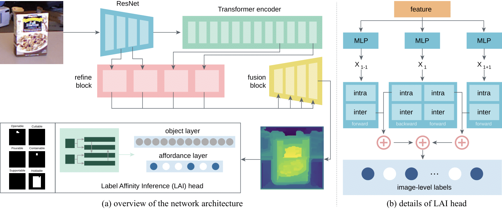
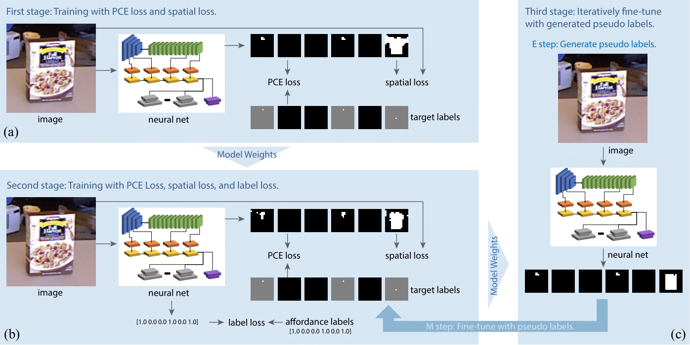

# STRAP: Structured Object Affordance Segmentation with Point Supervision

This is an official implementation of STRAP: Structured Object Affordance Segmentation with Point Supervision.




## Abstract

With significant annotation savings, point supervision has been proven effective for numerous 2D and 3D scene understanding problems. This success is primarily attributed to the structured output space; i.e., samples with high spatial affinity tend to share the same labels. Sharing this spirit, we study affordance segmentation with point supervision, wherein the setting inherits an unexplored dual affinity—spatial affinity and label affinity. By label affinity, we refer to affordance segmentation as a multi-label prediction problem: A plate can be both holdable and containable. By spatial affinity, we refer to a universal prior that nearby pixels with similar visual features should share the same point annotation. To tackle label affinity, we devise a dense prediction network that enhances label relations by effectively densifying labels in a new domain (i.e., label co-occurrence). To address spatial affinity, we exploit a Transformer backbone for global patch interaction and a regularization loss. In experiments, we benchmark our method on the challenging CAD120 dataset, showing significant performance gains over prior methods.

## Prerequisites

### Requirements

We have verified our codebase by pytorch == 1.12.1 with CUDA == 11.6 in python == 3.8.10, the following are requirements.

```
numpy==1.21.5
pillow==9.2.0
pytorch==1.12.1
pyyaml==6.0
scikit-image==0.19.2
scipy==1.7.3
tensorboard==2.9.0
timm==0.6.7
tqdm==4.64.0
```

### Data Preprocessing

#### Step 1

Download the CAD120 affordance dataset from [here](https://zenodo.org/record/495570). All point annotations are stored in `./data_preprocess/CAD120/keypoints.txt`.

#### Step 2

Use `./datasets/CAD120/generate.py` to preprocess the dataset. Meanwhile, modify the script to customize your own path.

The dataset after preprocessing is similar to the following.

```
cad120
├── actor
│   ├── images
│   ├── labels
│   ├── train_affordance_keypoint.yaml
│   ├── train_affordance.txt
│   └── val_affordance.txt
└── object
    ├── images
    ├── labels
    ├── train_affordance_keypoint.yaml
    ├── train_affordance.txt
    └── val_affordance.txt
```

## Training

### Step 1

Before starting your training, you need to modify some variables in `train.sh`. The following are some details.

```
# You should select a split mode of CAD120 dataset. (object or actor)
SPLIT_MODE="object"
# You should assign your dataset's root path which is preprocessed by what mentioned above.
DATASET_ROOT_PATH="../dataset/cad120"
 # You can choose where to store the output of training.
OUTPUT_PATH_NAME="outputs"
```

### Step 2

Use `sh train.sh` in terminal to start your training.

## Evaluation

We provide a jupyter notebook `visualize.ipynb` to get a visualized results.

The variables which you need to customize are shown as follows.

```
# You should select a split mode of CAD120 dataset. (object or actor)
split_mode = "object"
# You should assign your dataset's root path which is preprocessed by what mentioned above.
dataset_root_path = "../dataset/cad120"
# You should assign the path of your pre-trained model.
resume = "./model.pth"
# And the basename of a file.
file_name = "10001_1"
```

## Pre-trained Models

### Object Split

| Stage | Epoch | URL                                                                                      |
| :----: | :---: | ---------------------------------------------------------------------------------------- |
| first |  100  | [first_100.pth](https://huggingface.co/Leiyao-Cui/STRAP/blob/main/object/first_100.pth)     |
| second |  100  | [second_100.pth](https://huggingface.co/Leiyao-Cui/STRAP/blob/main/object/second_100.pth)   |
| third |  100  | [third_100.pth](https://huggingface.co/Leiyao-Cui/STRAP/blob/main/object/third_100.pth)     |
| first | BEST | [first_best.pth](https://huggingface.co/Leiyao-Cui/STRAP/blob/main/object/first_best.pth)   |
| second | BEST | [second_best.pth](https://huggingface.co/Leiyao-Cui/STRAP/blob/main/object/second_best.pth) |
| third | BEST | [third_best.pth](https://huggingface.co/Leiyao-Cui/STRAP/blob/main/object/third_best.pth)   |

### Actor Split

| Stage | Epoch | URL                                                                                     |
| :----: | :---: | --------------------------------------------------------------------------------------- |
| first |  100  | [first_100.pth](https://huggingface.co/Leiyao-Cui/STRAP/blob/main/actor/first_100.pth)     |
| second |  100  | [second_100.pth](https://huggingface.co/Leiyao-Cui/STRAP/blob/main/actor/second_100.pth)   |
| third |  100  | [third_100.pth](https://huggingface.co/Leiyao-Cui/STRAP/blob/main/actor/third_100.pth)     |
| first | BEST | [first_best.pth](https://huggingface.co/Leiyao-Cui/STRAP/blob/main/actor/first_best.pth)   |
| second | BEST | [second_best.pth](https://huggingface.co/Leiyao-Cui/STRAP/blob/main/actor/second_best.pth) |
| third | BEST | [third_best.pth](https://huggingface.co/Leiyao-Cui/STRAP/blob/main/actor/third_best.pth)   |

## Acknowledgments

The point annotations of CAD120 dataset are duplicated from [keypoints.txt](https://github.com/ykztawas/Weakly-Supervised-Affordance-Detection/blob/master/weakly_supervised_affordance_detection_master/expectation_step/keypoints.txt).

Parts of code are on based on the [Cerberus](https://github.com/OPEN-AIR-SUN/Cerberus) and [BINN](https://github.com/daveboat/structured_label_inference).
